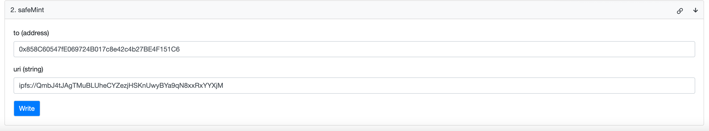
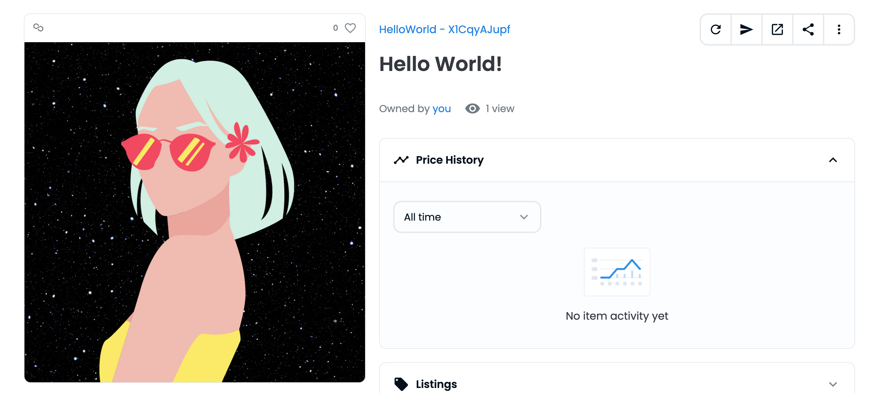

# Road To Web3: Week 1 🥳

### Tutorial Link: https://docs.alchemy.com/docs/how-to-develop-an-nft-smart-contract-erc721-with-alchemy
### Side Note: I didn't follow the tutorial exactly but I achieved the same outcome, I modified it to deploy on Polygon & used Hardhat instead of Remix.

### Used [Filebase](https://filebase.com/) for hosting my metadata on IPFS.
### View My Minted NFT: https://testnets.opensea.io/assets/mumbai/0x9708005b48b05022293daa6ed5d8b551eebefbf1/1
* View the metadata in the `metadata1.json` file

### How did I mint?
    1. First, I used OpenZepplin's Smart Contract Wizard to create my ERC21 Smart Contract. [see here](https://docs.openzeppelin.com/contracts/4.x/wizard)
    2. Then, I added code to only allow 1 mint per user. The total NFT supply is 10. 
    3. I deployed my contract to Mumbai & also verified my contract! Verifying my contract allows me to write to my contract directly from PolygonScan! 
    4. I then connected my wallet & called the `safeMint()` function with my address & the link to my metadata stored on IPFS
    5. You have to make sure your metadata meets OpenSea's metadata standards for it to be able to display it. [see here](https://docs.opensea.io/docs/metadata-standards)
       1. Address: `0x858C60547fE069724B017c8e42c4b27BE4F151C6`
       2. URI: `ipfs://QmbJ4tJAgTMuBLUheCYZezjHSKnUwyBYa9qN8xxRxYYXjM`
        
    6. That's it!
        
### Commands:
```
yarn compile
```
### Deploy to Polygon Mumbai testnet:
```
yarn deploy
```
### Output:
```
Using address 0xC0c630f5c9A78A75a92617852AD0F4E80BF252Cf
Wallet balance 0.7624262968620278
Deploying contract...
Awaiting confirmations
Completed!
Contract deployed to: 0x9708005B48B05022293Daa6ED5D8b551eEBefbF1
```

### [Verify Smart Contract on Polygonscan using Hardhat](https://coinsbench.com/verify-smart-contract-on-polygonscan-using-hardhat-9b8331dbd888)

```
yarn hardhat verify 0x9708005B48B05022293Daa6ED5D8b551eEBefbF1 --network mumbai
```
### Output:
```
Successfully submitted source code for contract
contracts/MintNFT.sol:HelloWorld at 0x9708005B48B05022293Daa6ED5D8b551eEBefbF1
for verification on the block explorer. Waiting for verification result...

Successfully verified contract HelloWorld on Etherscan.
https://mumbai.polygonscan.com/address/0x9708005B48B05022293Daa6ED5D8b551eEBefbF1#code
```# mintNFT
